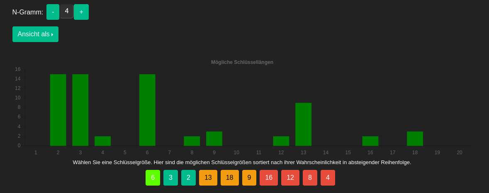
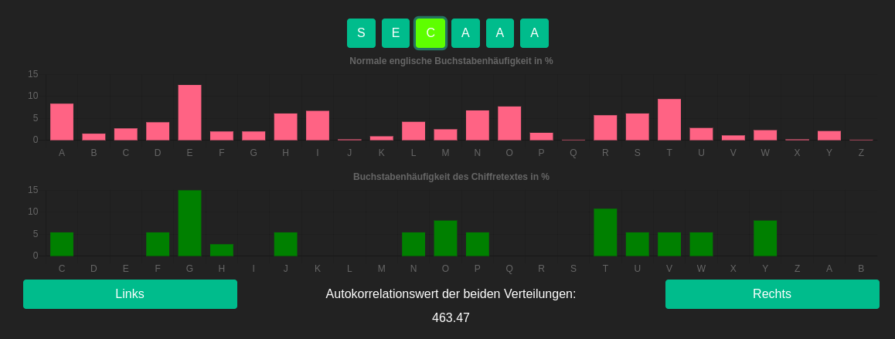

= Praktikum 1

Date:: 25.04.2024
Students:: Eichhorn Lennart 759253

== Implementing a simple permutation cipher

.`permutate` implementation
[source,rust]
----
include::src/main.rs[]
----

.Running `permutate` with the supplied inputs
[source,console]
----
$ permutate --text helloworld --key 13042
elhololwdr
$ permutate --text publicvoidmain --key 13042
ulpibvicdoanmxi
$ permutate --text thisisnotamiracle --key 13042
hstiintsaoiamcrexlxx
----

== Cryptanalysis and CrypTool

=== Describe an algorithm to break a Vigenère cipher

To break a Vigenère cipher, you first need to determine the key length. This involves dividing the cipher text into subsequences based on assumed key lengths and calculating the Index of Coincidence for each subsequence. The key length yielding the highest average Index of Coincidence is likely the correct one.

Once you have the key length, treat the cipher text as separate Caesar ciphers. Analyze the frequency of letters in each subsequence to deduce the shift used for encryption. Assemble these shifts to reconstruct the complete key.

=== Decrypting a text encrypted with a Vigenère cipher

We used the legacy cryptools online https://legacy.cryptool.org/en/cto/vigenerebreak[vignere analysis tool] to analyse and decrypt the ciphertext.

.Ciphertext
[source]
----
Ww yrv xarorp xarg Vrmwrolxmwv fzi zwvcui bzvg Vmxj ewjfkmivvxx.
Ww yrvxf kgeen kmgsig Wmgi mg altvq Gwwv lrw vmg Vrmwrolxmwv hiinli
uzga kgjfr lwlt ryy altvr Gsgjnyvzw. Gzrxk Xcxil oet vw xfhnzga ksyvmm
mrf ryl vip Vmxjr gexlulnliixxge wxulu gymrqwexxji Gexewmp.
----

Analyzing the distribution of 4-grams for different key lengths, we found that the most likely key length is 6. 

Next we found the most likely letter for each position in the key by analyzing the distribution of letters in the ciphertext. We selected the letter that produced the best Index of Coincidence for each position. That gave us the password `SECRET`. The resulting text seems coherent and readable.

.Decrypted plaintext
[source]
----
ES WAR EINMAL EINE ENTENMUTTER DIE GERADE IHRE EIER AUSBRUETETE.
ES WAREN GENAU SIEBEN EIER IN IHREM NEST UND DIE ENTENMUTTER FREUTE
SICH SCHON SEHR AUF IHREN NACHWUCHS. EINES TAGES WAR ES ENDLICH SOWEIT
UND AUS DEN EIERN ENTSCHLUEPFTEN SECHS PUTZMUNTERE ENTLEIN.
----

=== Decrypting a text encrypted with a substitution cipher

.Ciphertext
[source]
----
Oet vcntj chht vsjptnoydktj sjp ieq tejti bthrtj, zcnqtj Atptnahcsi utnotdtj.
Jsn pco oetrqt Te hcb jkyd eiitn sjutnotdnq ej ednti Jtoq. To vcn bnktootn
cho pet cjptntj Tetn sjp ok otdn pet Tjqtjisqqtn csyd pcnstrtn jcydpcydqt,
gkjjqt oet oeyd jeydq tnejjtnj vcjj oet to tebtjqheyd bthtbq dcqqt?
----

We got the following substitution key by analyzing the frequency of letters in the ciphertext and comparing it to the frequency of letters in the German language. In case of letters with similar frequencies, we used the context of the text to make an educated guess.

.Substitutions (key)
[source]
----
abcdefghijklmnopqrstuvwxyz
fgahiyklmnoxjrsdtbuevwqpcz
----

.Decrypted plaintext
[source]
----
Sie waren alle wunderschoen und mit einem gelben, zarten Federflaum versehen.
Nur das siebte Ei lag noch immer unversehrt in ihrem Nest. Es war groesser
als die anderen Eier und so sehr die Entenmutter auch darueber nachdachte,
konnte sie sich nicht erinnern wann sie es eigentlich gelegt hatte?
----

